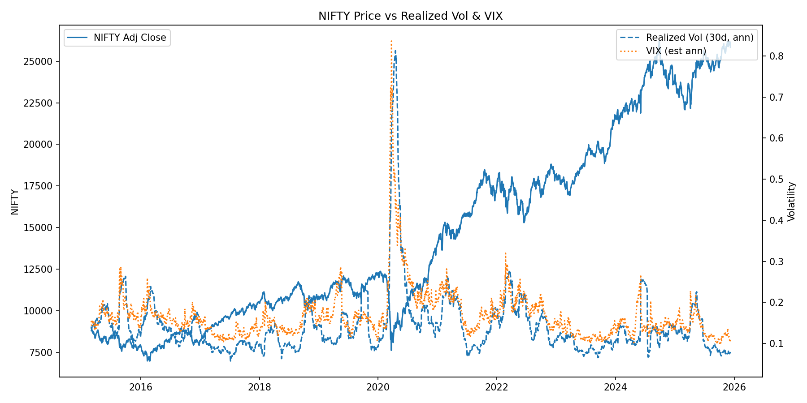
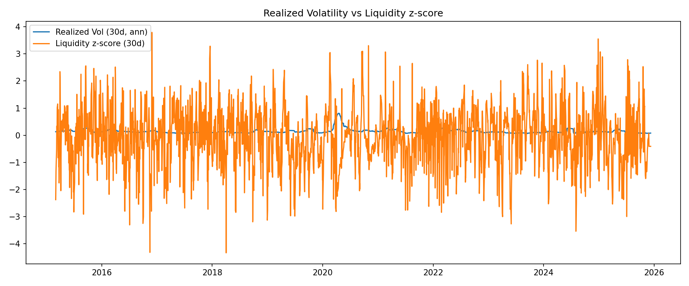
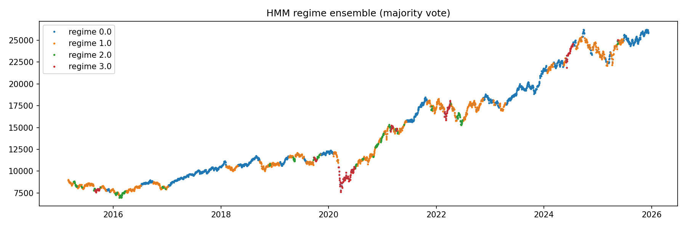
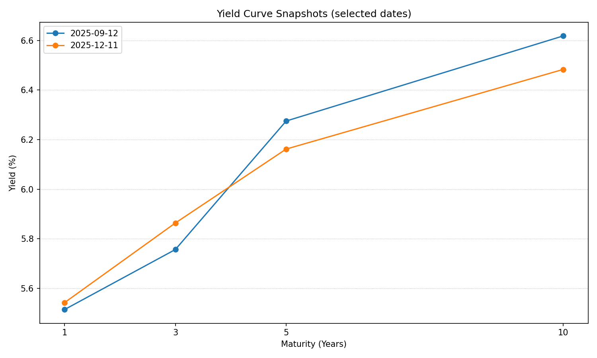
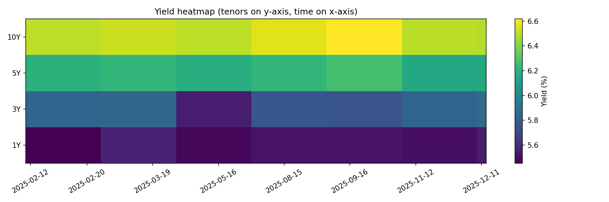

# Financial Markets Regime & Liquidity Stress Analysis

**Policy Report — RBI FMD Style**

**Data & files used:**

* `data/clean/market_dataset_with_regimes.csv`
* `data/clean/hmm_regime_diagnostics.xlsx`
* Plots: `plots/ts_prices_vol_vix.png`, `plots/vol_liquidity_timeseries.png`, `plots/hmm_regime_ensemble.png`, `plots/yield_curve_snapshots.png`, `plots/yield_curve_heatmap.png`

---

## **1. Executive Summary**

This quantitative framework integrates realized volatility, implied volatility (India VIX), yield‑curve structure, and RBI LAF liquidity conditions to detect market regimes using a Hidden Markov Model (HMM) ensemble. Four structurally distinct regimes emerge: **Calm**, **Mild Tightening**, **Stress**, and **Crisis**. Together, they map the evolving interaction between market risk, liquidity pressures, and policy-sensitive financial conditions.

Regime 0 and Regime 1 dominate the sample, accounting for nearly **86%** of all trading days. These represent normal and mildly constrained conditions where routine or tactical liquidity operations suffice. Regime 2 and Regime 3 are rarer but indicate **high-impact stress episodes**, where volatility accelerates sharply and systemic liquidity tightens.

Transitions across regimes exhibit persistence, with Crisis and Calm states showing strong self‑retention. Stress tends to revert to Mild Tightening but can escalate into Crisis under compounding liquidity pressure. These insights provide early-warning signals for policy response, enabling timely adjustments in VRR, VRRR, LTROs, SDF/MSF corridors, and open market operations.

---

## **2. Key Diagnostics & Figures**

### **2.1 Price, Realized Volatility & VIX**

*(From pipeline output — NIFTY, RV, VIX)*



### **2.2 Volatility–Liquidity Interaction**



### **2.3 Ensemble Regime Timeline**



### **2.4 Yield Curve Snapshots & Heatmap**




---

## **3. Regime Fingerprints (Quantitative Summary)**

The table below summarizes the distinctive properties observed in each regime.

| Regime                  | Count | Mean RV | Mean VIX | Mean Liquidity Z | Std Return | Mean Price |
| ----------------------- | ----: | ------: | -------: | ---------------: | ---------: | ---------: |
| **0 — Calm**            |  1120 |   0.095 |    0.132 |          -0.0056 |     0.0061 |   15469.98 |
| **1 — Mild Tightening** |  1145 |   0.150 |    0.174 |           -0.063 |     0.0096 |   14214.97 |
| **2 — Stress**          |   191 |   0.188 |    0.204 |          -0.0785 |     0.0129 |   11755.33 |
| **3 — Crisis**          |   181 |   0.337 |    0.294 |           -0.510 |     0.0235 |   13690.29 |

*These values come directly from your pipeline’s latest diagnostic output.*

---

## **4. Regime Transition Structure**

The transition matrix below illustrates the probability of moving from one regime to another on the following day.

```
           0         1         2         3
0  0.984808  0.015192  0.000000  0.000000
1  0.014847  0.965066  0.017467  0.002620
2  0.000000  0.104712  0.869110  0.026178
3  0.005525  0.011050  0.027624  0.955801
```

### **Interpretation:**

* **Calm (0)** is extremely persistent → ~98% chance of remaining calm next day.
* **Mild Tightening (1)** can move into Stress with ~1.7% probability.
* **Stress (2)** most often reverts toward Mild Tightening, but ~2.6% transitions into Crisis.
* **Crisis (3)** stays in Crisis ~95% of the time → systemic events are sticky.

---

## **5. Policy Recommendations (RBI‑FMD Oriented)**

### **Regime 0 — Calm**

* Maintain standard VRR/VRRR operations.
* No structural liquidity adjustment required.
* Focus on signalling & stability of the policy corridor.

### **Regime 1 — Mild Tightening**

* Monitor repo–reverse repo spreads for friction.
* Tactical OMOs or short‑term injections may stabilize expectations.
* Strengthen communication when volatility slightly rises.

### **Regime 2 — Stress**

* Initiate targeted liquidity support (SDF/MSF balance adjustments, overnight repos).
* Increase VRR injection frequency.
* Communicate explicitly to reduce risk premia.

### **Regime 3 — Crisis**

* Deploy comprehensive liquidity augmentation: LTROs, OMOs, special windows.
* Evaluate need for MSS or government securities operations.
* Highlight systemic backstops through strong guidance.

---

## **6. Appendix & Reproducibility**

* Scripts are located under `/src/` in modular form.
* The full merged dataset is in `data/clean/market_dataset_with_regimes.csv`.
* HMM model statistics are in `data/clean/hmm_model_stats.csv`.
* Running `python src/hmm_regime_detection.py` will retrain models.
* Notebook `main.ipynb` can reproduce tables and visuals.

---

*Prepared using the Market-Regime-Liquidity-Model pipeline — Naman Narendra Choudhary.*
